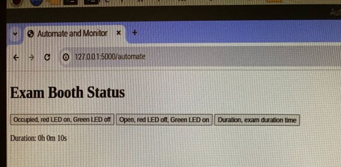
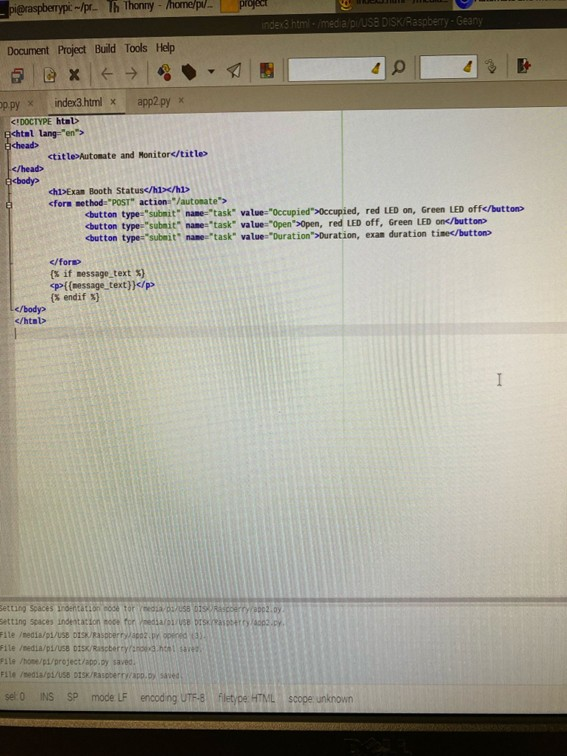
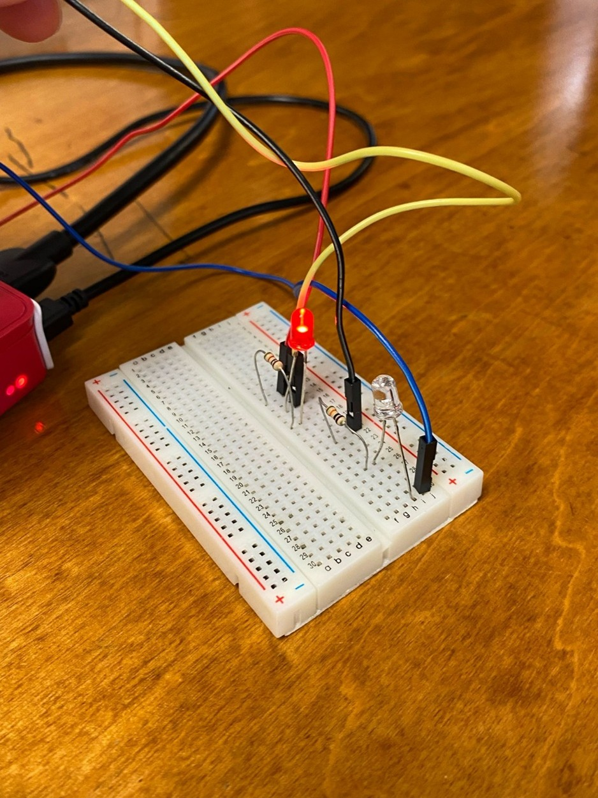
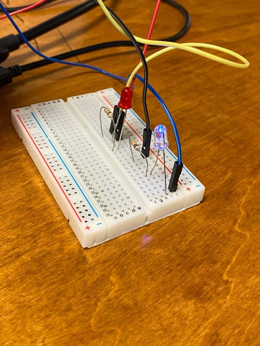

# IoT LED Control with Flask (Room Occupancy Timer)

Simple web application using Flask and gpiozero to control two LEDs (red/green) on a Raspberry Pi and measure the duration between "Occupied" and "Open" states.

## Description
- Red LED: Indicates "Occupied" mode (timer starts)  
- Green LED: Indicates "Open" mode (timer stops)  
- Web interface allows clicking buttons to toggle states and calculate duration in hours/minutes/seconds  
- Built as homework/project for IoT/embedded programming.

## Technologies Used
- Python 3
- Flask (web framework)
- gpiozero (GPIO control for Raspberry Pi)
- HTML/CSS (basic template)

## Hardware Requirements
- Raspberry Pi (any model with GPIO)
- 2 LEDs (red on GPIO 4, green on GPIO 21) + resistors
- Breadboard and jumper wires

## How to Run
1. Install dependencies:  
   pip install flask gpiozero
2. Connect LEDs:
- Red LED: GPIO 4
- Green LED: GPIO 21
3. Run the app:
  python app.py
4. Open in browser:
  http://<your-raspberry-pi-ip>:5000 (or http://localhost:5000 if running locally)

## Features
- Toggle between "Occupied" (red LED on, timer start) and "Open" (green LED on, timer stop)
- Calculate and display duration in h:m:s format
- Error handling for checking duration without starting/stopping timer

## Skills Demonstrated
- Web development with Flask
- Hardware control via GPIO on Raspberry Pi
- State management and timers
- Form handling (POST requests)
- Basic error checking and user feedback

## Screenshots

**Web Interface:**

**Circuit Setup:**

**Occupied State (Red LED on):**

**Open State (Green LED on):**

Class assignment from Associate in Science in Computer Programming – Palm Beach State College.
Feedback welcome!
